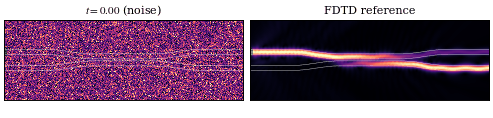

# PIC-Flow: Physics-Based Flow Matching for Full-Field Prediction of Silicon Photonic Devices

A neural surrogate that replaces FDTD simulation for 2D photonic device field prediction.
PIC-Flow pairs a real-valued U-Net with **conditional flow matching** and a **Helmholtz residual
loss** to generate complex electromagnetic fields ($E_z$) for parameterized silicon-photonic
devices given their permittivity map, source-port mask, and wavelength.

<p align="center">
  
</p>

The animation shows what the model actually does on a directional coupler: starting from
Gaussian noise (left, $t=0$), PIC-Flow integrates a learned velocity field along $t \in [0, 1]$
until the field converges to a prediction (left, $t=1$) that matches the FDTD reference
(right). On a single A100 the integration finishes in well under a second; the wall-clock
benchmark with as few as 20 Euler steps takes ≈ 444 ms and still hits 3 % Helmholtz
compliance, ~10× faster than 16-thread CPU FDTD on the same node.

> Regenerate the GIF: `python tools/denoising_trajectory.py --device directional_coupler`,
> then `cp outputs/denoising/trajectory_directional_coupler.gif assets/denoising_directional_coupler.gif`.

```
input:  (epsilon, source mask, wavelength)  -->  PIC-Flow U-Net (Euler/Heun ODE sampler)  -->  E_z(x,y)
```

Trained dataset covers three device families at 1.55 µm (multimode interferometers, Y-branches,
and directional couplers — 22 500 FDTD simulations total).

---

## Install

```bash
git clone https://github.com/Rizzo-Integrated-Photonic-Systems-Lab/PIC-Flow.git
cd PIC-Flow

# Core deps. PyTorch must match your CUDA — install separately if pip's default doesn't fit:
#   pip install torch --index-url https://download.pytorch.org/whl/cu121
pip install -r requirements.txt

# Optional: only needed if you (a) generate FDTD data yourself via FDTD/unified_sweep.py
# or notebook 01, or (b) run the FDTD-comparison benchmarks under tools/
# (benchmark_dc_inference_methods.py, benchmark_fdtd_vs_inference.py).
# Inference, training, and notebook 03 do NOT need meep.
# Meep is best installed via conda-forge: `conda install -c conda-forge pymeep`.
```

Tested with Python 3.10+, PyTorch 2.x, CUDA 11.8 / 12.1 / 12.8 on **Linux and macOS**.
Windows is not a supported platform — Meep has no native Windows build, and several
PyTorch features used here (`torch.compile` / Triton) are Linux-only.
Windows users should run inside [WSL2](https://learn.microsoft.com/windows/wsl/install)
with an Ubuntu environment.

---

## Quickstart

The fastest path to seeing the model work:

```bash
# 1) install (above) + jupyterlab + huggingface_hub
pip install jupyterlab huggingface_hub

# 2) pull the pretrained FM+phase+residual checkpoint (~1 GB)
hf download RizzoLab/PIC-Flow checkpoints/phase_residual_300.pt --local-dir .

# 3) pull the held-out test shard you'll evaluate on
hf download RizzoLab/PIC-Flow-Dataset --repo-type dataset shards/index.json \
    --local-dir Data/unified_sweep_mmi_ybranch_dc_7500_each_1p55um
hf download RizzoLab/PIC-Flow-Dataset --repo-type dataset shards/shard_00000.npz \
    --local-dir Data/unified_sweep_mmi_ybranch_dc_7500_each_1p55um
#   (notebook 03 only reads one shard; pull the rest later if you want training/eval.)

# 4) open the inference notebook
jupyter lab notebooks/03_inference.ipynb
```

Hosted artifacts:

- Checkpoints: [huggingface.co/RizzoLab/PIC-Flow](https://huggingface.co/RizzoLab/PIC-Flow)
- Dataset (22 500 FDTD samples, 13 GB): [huggingface.co/datasets/RizzoLab/PIC-Flow-Dataset](https://huggingface.co/datasets/RizzoLab/PIC-Flow-Dataset)

The three notebooks cover the full lifecycle:

| Notebook | What it shows | Needs Meep? | Needs dataset? |
|---|---|---|---|
| [`notebooks/01_dataset_generation.ipynb`](notebooks/01_dataset_generation.ipynb) | Generate a small FDTD dataset (~10 geometries/family) with `FDTD/unified_sweep.py`. | Yes | No (writes one) |
| [`notebooks/02_training.ipynb`](notebooks/02_training.ipynb) | Smoke-train the U-Net on a tiny subset; loss curves. | No | Yes (full pull) |
| [`notebooks/03_inference.ipynb`](notebooks/03_inference.ipynb) | Load the FM+phase+residual checkpoint, predict $E_z$ on a test sample, plot triptych + compliance. | No | Yes (one shard) |

### Training (full)

```bash
# Released-checkpoint architecture (~63 M params). The default --hidden-size and
# --num-res-blocks in train.py build a different ~247 M model, so pass these
# explicitly to reproduce phase_residual_300.pt:
ARCH="--hidden-size 56 --num-res-blocks 3 --attn-resolutions 4,8"

# Single GPU
python Model/train.py --data-root Data/ --use-shards $ARCH --epochs 300 --batch-size 4

# Multi-GPU (DDP)
torchrun --nproc_per_node=4 Model/train.py --data-root Data/ --use-shards $ARCH --batch-size 16

# Three paper runs (FM, FM+phase, FM+phase+residual)
python Model/train.py --data-root Data/ --use-shards $ARCH --lambda-residual 0   --lambda-phase 0
python Model/train.py --data-root Data/ --use-shards $ARCH --lambda-residual 0   --lambda-phase 0.1
python Model/train.py --data-root Data/ --use-shards $ARCH --lambda-residual 1.0 --lambda-phase 0.1
```

`python Model/train.py --help` lists all flags. The `--lambda-*` weights select which
of the three paper variants you train; the `$ARCH` flags pin width/depth to match the
released checkpoint.

### Inference (CLI)

```bash
# Single device folder (eps.npy, src_mask.npy, sparams.npz with wavelength_um)
python Model/sample.py --device-dir path/to/device/ --ckpt checkpoints/phase_residual_300.pt

# Parametric device (no FDTD needed; specify geometry directly)
python tools/predict_parametric_device.py --device directional_coupler \
    --gap 0.175 --L_c 5.97 --wavelength 1.55 --ckpt checkpoints/phase_residual_300.pt

# Full test-set sweep with metric histograms
python tools/test_set_histograms.py --ckpt checkpoints/phase_residual_300.pt --num-steps 100
```

### Dataset generation (FDTD)

The full 22 500-sample dataset is hosted on Hugging Face — most users should pull it
rather than regenerate:

```bash
hf download RizzoLab/PIC-Flow-Dataset --repo-type dataset \
    --local-dir Data/unified_sweep_mmi_ybranch_dc_7500_each_1p55um
```

To regenerate from scratch (requires Meep — Linux/macOS only, ~24 h on a 16-thread CPU):

```bash
python FDTD/unified_sweep.py --output-dir Data/ \
    --devices mmi,ybranch,directional_coupler \
    --num-samples 7500 --wavelengths 1.55
```

See [`Data/README.md`](Data/README.md) for the dataset layout.

---

## Repo layout

```
PIC-Flow/
├── Model/         neural network + training loop + flow matching
├── FDTD/          dataset generation (Meep-based) + per-device geometries
├── tools/         inference, benchmarks, evaluation
├── notebooks/     hands-on walkthroughs (start here)
└── Data/          (gitignored) FDTD ground-truth shards
```

---

## Citation

If you use this code, please cite:

```bibtex
@article{Quaratiello2026PICFlow,
  author  = {Joseph Quaratiello and Anthony Rizzo},
  title   = {Physics-Based Flow Matching for Full-Field Prediction of Silicon Photonic Devices},
  journal = {arXiv},
  year    = {2026}
}
```

A machine-readable [`CITATION.cff`](CITATION.cff) is included.

---

## License

MIT — see [`LICENSE`](LICENSE).
